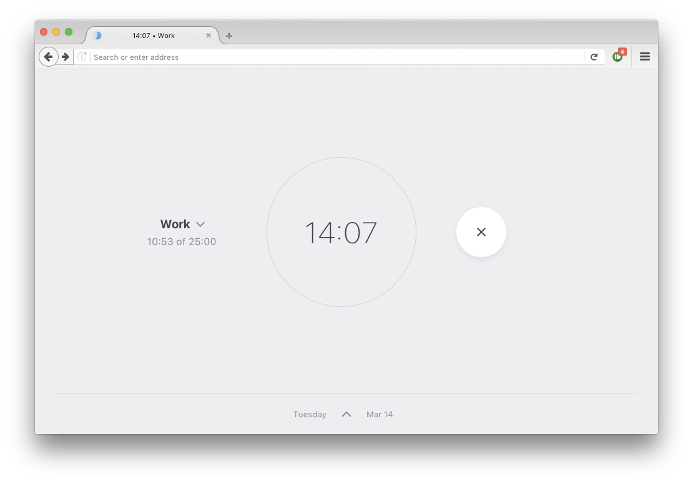

<h1 align='center'><br><br><br><br><br></h1>

> A polite web-based timer for hyper-productivity

[](http://ricostacruz.com/flowloop/)

[](https://travis-ci.org/rstacruz/flowloop "See test builds")

## About

Flowloop is a productivity timer that helps you maintain a [state of flow](https://en.wikipedia.org/wiki/Flow_(psychology)). It's based on the [Pomodoro Technique](https://en.wikipedia.org/wiki/Pomodoro_Technique). Unlike Pomodoro however, Flowloop keeps you aware of time without having to interrupt you.

- Every 25 minutes of uninterrupted work time is **1 lap**. A bell sound will be played when you finish a lap.

- The next lap will sound 1 more bell than the last, as long as your work is not interrupted. That is: 1 bell for the first lap, 2 bells for the second, and so on. This keeps you aware of how long you've been working.

- You can take a break any time you wish for as long as you want. Increasing number of bells will also play every 5 minutes to remind you to get back to work.

- Flowloop will keep a list of all your completed laps every day. This lets you see how productive you've been throughout the day and week.

## Rationale

Flowloop was born out of the frustration of Pomodoro timers all imposing 5-minute distraction breaks just as you're starting to get focused. I prefer a timer that gently reminds me of time spent, rather than one that requires my input 4 times in an hour.

Use Flowloop for:

- __Motivate yourself.__ By keeping a list of laps over the last week, you'll be giving yourself a subtle push of encouragement to perform as much as yesterday, if not better.

- __Manage distractions.__ By clearly designating time periods as for work and break, it helps you be more productive in your work and enjoy your breaks better.

- __Schedule work better.__ You'll be able to do around 10 laps in one typical work day. Awareness of laps will help you schedule your time wisely.

---

<details>
<summary>Set up instructions</summary>

## Set up

Requires Node 6+ and Yarn.

```sh
yarn            # First-time setup
yarn start      # Development server
```

```sh
yarn run build  # Build for production (builds into /public)
```

## What's here

| Path | Purpose
| --- | ---
| `/web/assets` | the files to be copied into `/public/assets`
| `/web/html` | the files to be copied into `/public`
| `/web/css` | CSS files (via PostCSS)
| `/web/js` | JS files (via Browserify)
| `/public` | The built files (gitignored)
</details>

<details>
<summary>To do list</summary>

## To do

- [x] Timer
- [x] Saving logs
- [x] Push notifications
- [x] Ding sound
- [ ] Rolling over
</details>

<details>
<summary>Sources</summary>

## Sources

- https://notificationsounds.com/standard-ringtones/echoed-ding-459
</details>

<details>
<summary>Electron mode</summary>

## Electron mode

Experimental - run it in Electron via:

```sh
# In separate terminals
yarn run electron:watch
yarn run electron:start
```

And package it via:

```sh
yarn run electron:dist
```
</details>

## Thanks

**flowloop** © 2017, Rico Sta. Cruz. Released under the [MIT] License.<br>
Authored and maintained by Rico Sta. Cruz with help from contributors ([list][contributors]).

> [ricostacruz.com](http://ricostacruz.com) &nbsp;&middot;&nbsp;
> GitHub [@rstacruz](https://github.com/rstacruz) &nbsp;&middot;&nbsp;
> Twitter [@rstacruz](https://twitter.com/rstacruz)

[MIT]: http://mit-license.org/
[contributors]: http://github.com/rstacruz/flowloop/contributors
